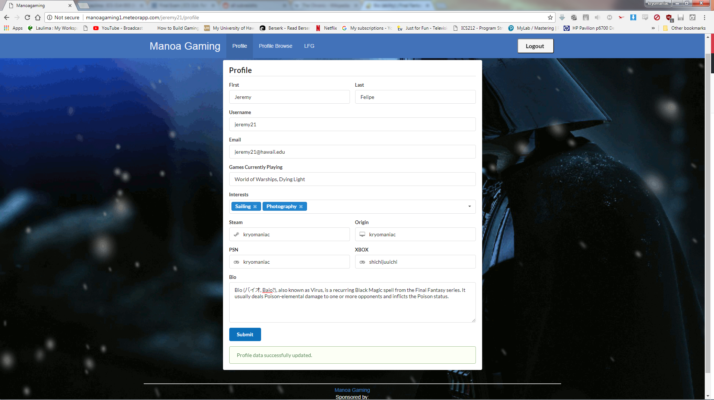
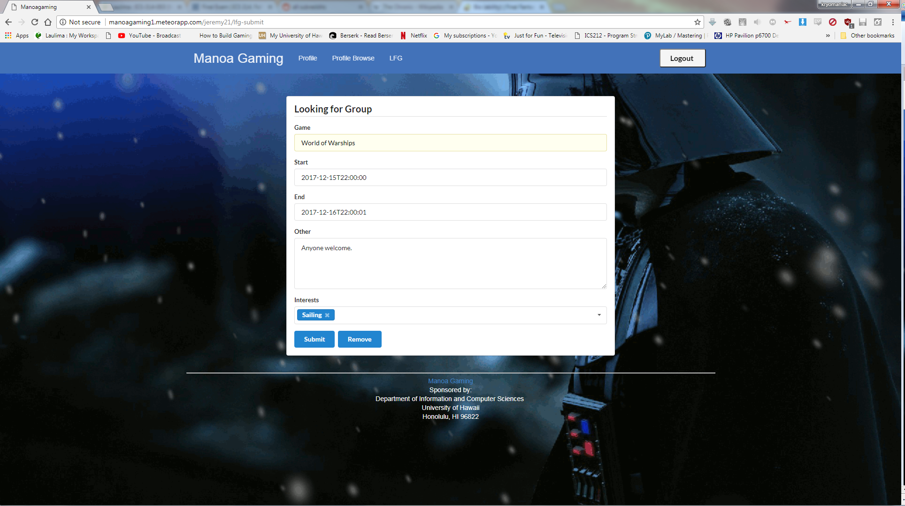
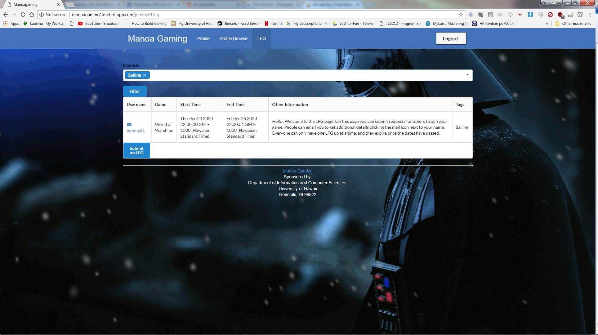

The culmination of my intro to Software Engineering class, this website is a way to connect gamers at UH Manoa. It uses Meteor for this results in a Mongo backend, Blaze frontend, with Kadira mediating the two. Furthermore, it's based around "Bowfolios," a basic networking site and a great foundation for a site like Manoa Gaming. As far as web development projects go, I don't know if I could've picked a better one to take a swing at, seeing as I'm a gamer myself and I would probably end up using this website at least once.

Everyone gets a profile when they log on for the first time, and they can fill in whatever relevant information they want to display to catch the eyes of other gamers. Aside from typical general information like name and email for contact, people can display their IDs from their platform of choice and whatever games they're currently playing. 

  

The LFG page is, in my opinion (because I developed it), the most important part of the site. It allows for people to put out requests to join and meet up for games. From my experience playing MMORPGs, most of the time people aren't looking to make meaningful connections with strangers, they just want some people to fill out a group or a needed position, usually a healer. By tagging appropriately on the LFG submit page, you can ensure your games can be found by the filter on the LFG page by those who feel like joining up. 

  

These LFGs expire eventually to prevent old requests filling up the system. In future updates I would implement a search system to compliment the filter system, streamline the date entry process with a calendar interface of sorts, and segregate the table into pages to organize higher volumes of entries. 

  

[Source](https://github.com/manoagaming/manoagaming)
[Site](http://manoagaming1.meteorapp.com/)
